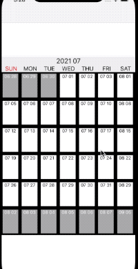

# Requirements
* iOS 13.0 이상

# CalendarView


# 사용방법
* ``CalendrView``를 매개변수를 지정하여 초기화하고, 
* UICollectionView를 구현하는 것과 마찬가지로, ``CalendarViewDataSource``, ``CalendarViewDelegate`` 를 채택합니다. 
* ( ``CalendarViewController.swift`` 코드를 참고하시면 됩니다.)
```swift
let calendarView: CalendarView = CalendarView(type: .month, startWeekDay: .sunday)
```

# 기능
* 각 cell마다 ``cellDate``를 가지고 있습니다. 이를 통해 해당 cell의 date를 가져올 수 있습니다.
```swift
func collectionView(_ collectionView: UICollectionView, cellForItemAt indexPath: IndexPath, cellDate: CalendarView.CalendarDay?)
```
* 현재 날짜기준으로 좌우 천년씩 스크롤 가능 ( ``numberOfItemInCalendar`` 을 변경하여 기간을 줄이거나 더 늘릴 수 있습니다 )
* 월간캘린더 또는 주간캘린더 가능 
```swift
// 월간캘린더 
let calendarView: CalendarView = CalendarView(type: .month, startWeekDay: .sunday)
// 주간캘린더
let calendarView: CalendarView = CalendarView(type: .week, startWeekDay: .sunday)
```
* 주를 일요일로 시작할지 월요일로 시작할지 지정가능 
```swift
// 일요일시작 
let calendarView: CalendarView = CalendarView(type: .month, startWeekDay: .sunday)
// 월요일시작
let calendarView: CalendarView = CalendarView(type: .month, startWeekDay: .monday)
```

# Stack 
* UIStackView
* UICollectionView
* UICollectionViewCompositionalLayout

# 구현과정
* [링크](https://vapor3965.tistory.com/62)에 개시해놨습니다.
